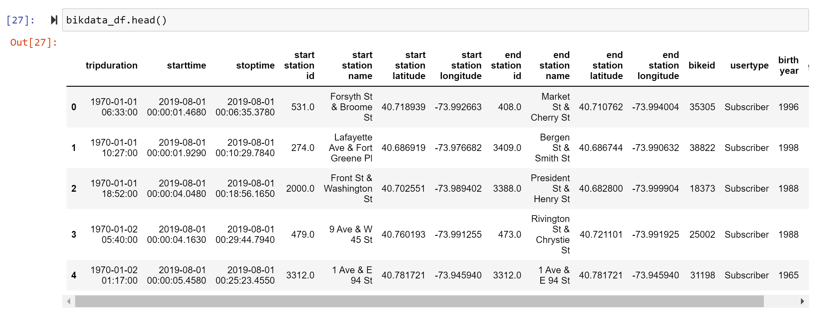
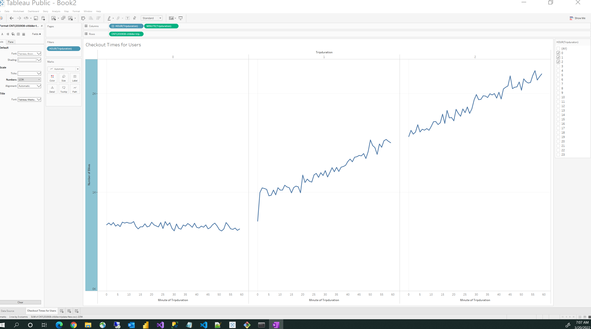
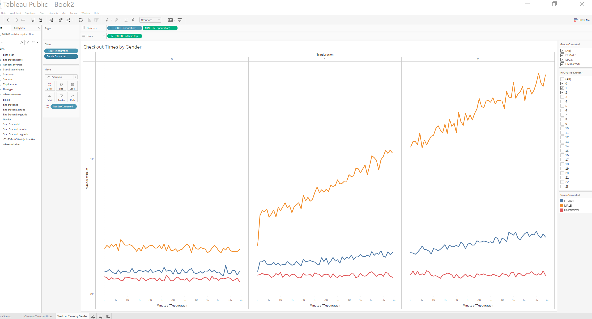
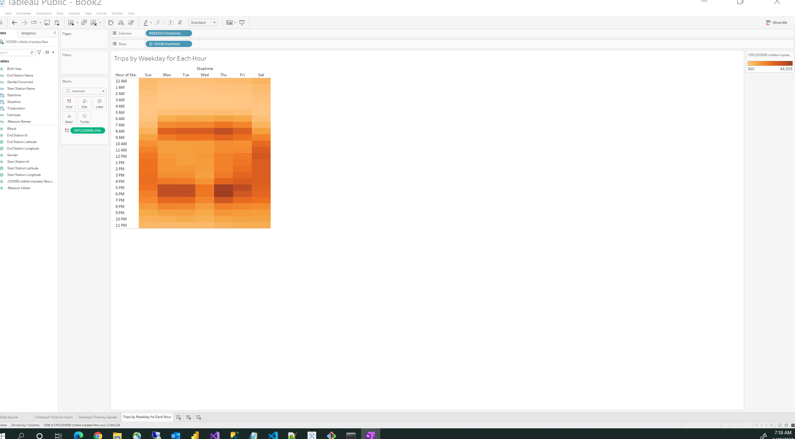
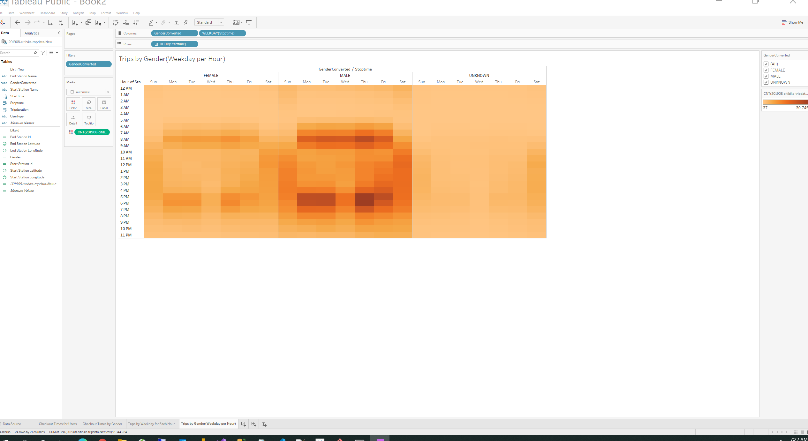
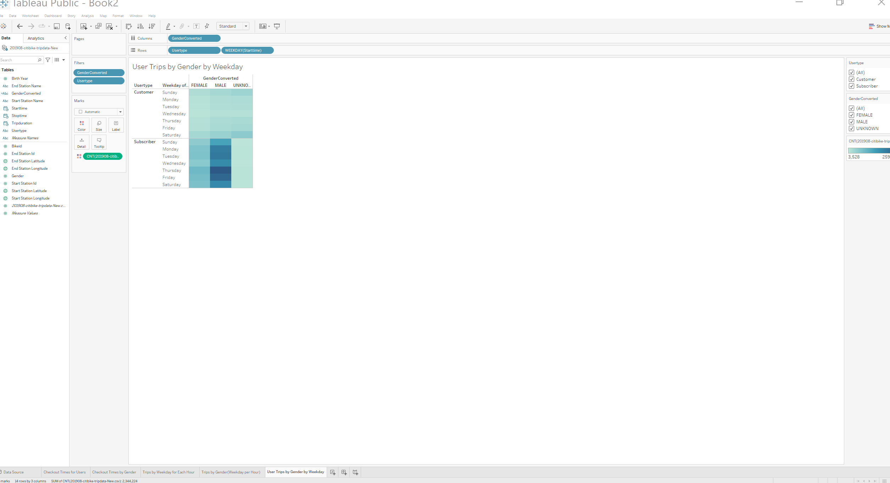

# bikesharing By: David Matheny Date:3/20/2022

# Deliverable 1:  Change Trip Duration to a Datetime Format (see pic below)

# Deliverable 2:  Create Visualizations for the Trip Analysis (see pics below)

## Checkout Times for Users

## Checkout Times by Gender

## Trips by Weekday for Each Hour

## Trips by Gender(Weekday per Hour)

## User Trips by Gender by Weekday

# Deliverable 3:  Create a Story and Report for the Final Presentation

## Overview of the analysis: We are looking to convince investors that a bike-sharing program in Des Moines is a solid business proposal. To solidify the proposal, one of the key stakeholders would like to see a bike trip analysis

## Results:

## Tableau link:  https://public.tableau.com/app/profile/david.matheny/viz/Project_16477874400440/Story1

### Checkout Times for Users

-The most bikes checkedout is roughtly 3k with a duration around 5 hours.

### Checkout Times by Gender

-Its obvious that males are using the bikes more

### Trips by Weekday for Each Hour

-Weekdays tend to have more rides in the morning and evening.  Where as weekends tend to have ride mostly during the day, as expected.

### Trips by Gender(Weekday per Hour)

-This graph just backs up what the last 2 graphs showed.  Males ride more and more during the times indciated in the "Trips by Weekday for Each Hours" slide.

### User Trips by Gender by Weekday

-Still Males ride the most particularly on Thrusdays.

### Summary:
-Based on the analysis for NYC it appears Males use the bikes the most, particularly on Thursdays and mainly Weekdays tend to have more rides in the morning and evening.  Where as weekends tend to have ride mostly during the day.

#### Summary my thoughts 1: We need more data 
-Comparing rural and urban areas and thinking they are going to follow the same patterns is a huge mistake and we need way more data before we can draw any conclusions.  Initally it looks like we should market to males since they use the bikes the most.  But maybe NYC has more males than females, and this is showing false trend.  Also the work habits from an urban are could be very different from rural area, in that what does the work force look like in Des Moines Males vs Females?  Also are bikes practical in Des Moines like they are in NYC, Des Moines might not have the sidewalk infrastrucre?

#### Summary 2 additional slides I would like to see on this dataset.
-1) Rides by starting and end locations (Interested in understanding what rides are tourist and what are workforce, this is signficant because you proably dont have tourist in Des Moines)

-2) Rides by starting and end locations by weekday(this would further help you determine who is in the workforce, people tend to work 8 to 5, or if your in IT its 8 to 9)

